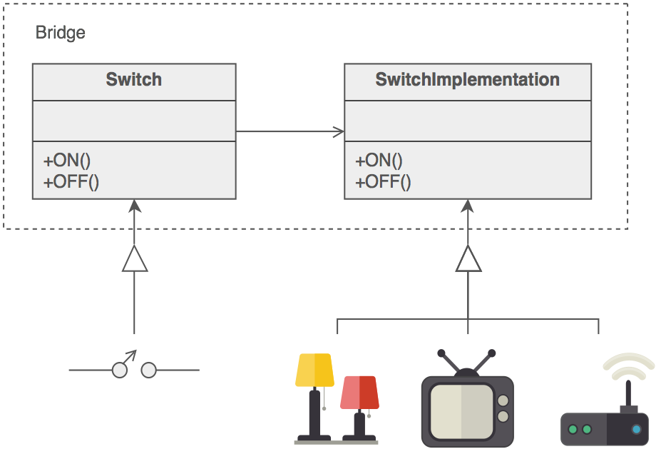

# Bridge Design Pattern

### Motivation
Обикновено когато искаме дадена абстракция да има различни имплементации се използва наследяване. Това върши работа в 99% от случаите. Понякога обача искаме имплементацията да не е закачена за абстракцията и да имаме свободата да ги разширяваме и променяме поотделно. По този начин имаме loose coupling в кода си и при промяна в едното не се налага да променяме другото. За да се осъществи това се използва Bridge шаблонът. 

### Intent
*   да разкачим имплементация от абстракция, за да може двете да се променят независимо

### Implementation & Structure
*   Abtraction - интерфейс за абстракцията
*   RefinedAbstraction - имплементация на основната абстракция
*   Implementor - интерфейс за имплементационните класове. Този интерфейс не взаимодейства директно с интерфейса на абстракцията. Важно е да отбележим, че връзката между двата е от тип has-a. Това означава че Abtraction съдържа в себе си обект/и от тип Implementor. На диграмата са означени с Implementor.
*   ConcreteImplementor - конкретнa имплементациq на горния интерфейс

Abtraction е абстракция, която може да бъде имплементирана, като съответната имплементация няма да зависи от конкретните имплементации на Implementor. Abtraction може да бъде разширяван без да влияе на Implementor, и обратно.


### Applicability & Examples

Както вече беше споменато по-горе Bridge се прилага, когато искаме да избегнем перманентното свързване между абстракция и имплементация, и когато искаме те да могат да бъдат разширявани независимо. 

Добър пример за Bridge е обикновеният ключ(switch), който служи за включване/изключване на лапми, телевизори, компютри и т.н. Основната цел на ключа е да пуска/спира дадено устройство. Конкретната имплементация няма значение стига да върши тази дейност. Тя може да бъде въже за дърпане, обикновен бутон, стенен ключ за лампа, touch screen сензор и т.н.



### Related Patterns

*   Abstract Factory Pattern  - този шаблон може да бъде използван за създаването на конкретен Bridge. Например factory може да избира подходящ имплементатор runtime.

### Code example
```cs
  using System;

  class MainApp
  {
    static void Main()
    {
      Abstraction ab = new RefinedAbstraction();

      // Set implementation and call 
      ab.Implementor = new ConcreteImplementorA();
      ab.Operation();

      // Change implemention and call 
      ab.Implementor = new ConcreteImplementorB();
      ab.Operation();

      // Wait for user 
      Console.Read();
    }
  }

  // "Abstraction" 
  class Abstraction
  {
    protected Implementor implementor;

    // Property 
    public Implementor Implementor
    {
      set{ implementor = value; }
    }

    public virtual void Operation()
    {
      implementor.Operation();
    }
  }

  // "Implementor" 
  abstract class Implementor
  {
    public abstract void Operation();
  }

  // "RefinedAbstraction" 
  class RefinedAbstraction : Abstraction
  {
    public override void Operation()
    {
      implementor.Operation();
    }
  }

  // "ConcreteImplementorA" 
  class ConcreteImplementorA : Implementor
  {
    public override void Operation()
    {
      Console.WriteLine("ConcreteImplementorA Operation");
    }
  }

  // "ConcreteImplementorB" 
  class ConcreteImplementorB : Implementor
  {
    public override void Operation()
    {
      Console.WriteLine("ConcreteImplementorB Operation");
    }
  }
```

### Output

```c
  ConcreteImplementorA Operation
  ConcreteImplementorB Operation
```