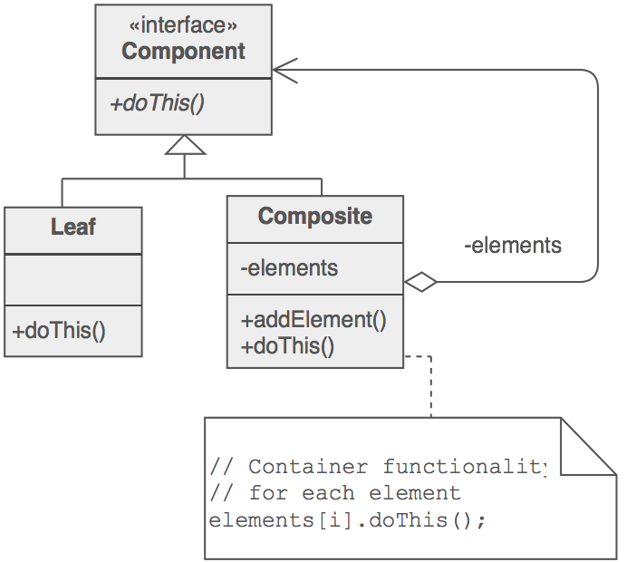

# Composite Design Pattern

### Motivation

Composite шаблонът се използва когато имаме дървовидна структура от данни и искаме да третираме клоните и листата по подобен начин. Най-простият пример е файловата система. Тя представлява дърво, в което клоните са папките, а файловете - листата. Очевидно папката(клонът) е много по-сложна като обект от файлът, защото може да съдържа в себе си други папки и файлове. Въпреки това те споделят много общи свойства - могат да бъдат копирани и местени, имат имена и размер и т.н. В този смисъл ще е по-лесно да ги третираме еднакво като ги обединим под общ интерфейс(напр. File System Resource)

### Intent
*	да композира обекти в дървовидна структура, за да представи йерархия от вида част-цяло
*	шаблонът позволява индивидуалните обекти(листа) и композициите от обекти(клони) да бъдат третирани еднакво

### Implementation & Structure
*   Component - интерфейс за листата и клоните. Трябва да бъде имплементиран от всички обекти в композицията. Дефинира методите, които са общи за двата типа компоненти в дървовидната структура
*   Leaf - обекти, които нямат деца
*   Composite - обект, който съдържа в себе си други обекти, които също са от тип Component. Освен методите наследени от съответния интерфейс, съдържа методи за добавяне, премахване, показване и т.н. на елементите, които съдържа. 




### Applicability & Examples

Както вече беше споменато по-горе Composite се прилага, когато имаме йерархия от вида част-цяло и клиентът иска да използва обектите еднакво без значение дали са листа или клони. Примери: 
*	Менюта, които съдържат елементи, които също могат да са менюта
*	Файлова система - папки, които могат да съдържат други папки и файлове 
*	Обекти контейнери, който съдържат други обекти, които може да са също контейнери

### Related Patterns

*	Decorator - Декоратор шаблонът често се използва заедно с Composite. В такъв случай те обикновено имат общ родителски клас. Така декораторите ще трябва да наследяват Component интерфейса с методи като Add, Remove, и GetChild. 

### Code example
```cs
    using System;
    using System.Collections;

      class MainApp
      {
        static void Main()
        {
          // Create a tree structure 
          Composite root = new Composite("root");
          root.Add(new Leaf("Leaf A"));
          root.Add(new Leaf("Leaf B"));

          Composite comp = new Composite("Composite X");
          comp.Add(new Leaf("Leaf XA"));
          comp.Add(new Leaf("Leaf XB"));

          root.Add(comp);
          root.Add(new Leaf("Leaf C"));

          // Add and remove a leaf 
          Leaf leaf = new Leaf("Leaf D");
          root.Add(leaf);
          root.Remove(leaf);

          // Recursively display tree 
          root.Display(1);

          // Wait for user 
          Console.Read();
        }
      }

      // "Component" 
      abstract class Component
      {
        protected string name;

        // Constructor 
        public Component(string name)
        {
          this.name = name;
        }

        public abstract void Add(Component c);
        public abstract void Remove(Component c);
        public abstract void Display(int depth);
      }

      // "Composite" 
      class Composite : Component
      {
        private ArrayList children = new ArrayList();

        // Constructor 
        public Composite(string name) : base(name) 
        {  
        }

        public override void Add(Component component)
        {
          children.Add(component);
        }

        public override void Remove(Component component)
        {
          children.Remove(component);
        }

        public override void Display(int depth)
        {
          Console.WriteLine(new String('-', depth) + name);

          // Recursively display child nodes 
          foreach (Component component in children)
          {
            component.Display(depth + 2);
          }
        }
      }

      // "Leaf" 
      class Leaf : Component
      {
        // Constructor 
        public Leaf(string name) : base(name) 
        {  
        }

        public override void Add(Component c)
        {
          Console.WriteLine("Cannot add to a leaf");
        }

        public override void Remove(Component c)
        {
          Console.WriteLine("Cannot remove from a leaf");
        }

        public override void Display(int depth)
        {
          Console.WriteLine(new String('-', depth) + name);
        }
      }
```

### Output

```c
    -root
    ---Leaf A
    ---Leaf B
    ---Composite X
    -----Leaf XA
    -----Leaf XB
    ---Leaf C
```